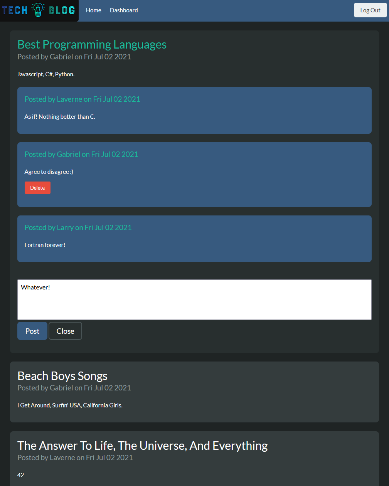
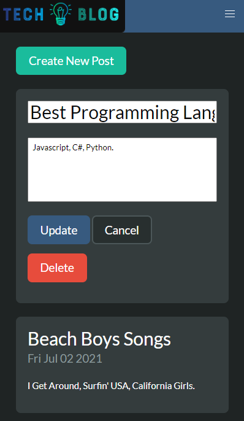

# Tech Blog

## Description:

A CMS-style tech blog site where users can publish new posts and comment on existing posts. It follows the MVC paradigm in its architectural structure, using Handlebars.js as the templating language, Sequelize as the ORM, and the express-session npm package for authentication. It is deployed on Heroku.

## Table of Contents:

- [Usage](#usage)
- [License](#license)
- [Contributing](#contributing)
- [Questions](#questions)

### Usage

The deployed app can be viewed here: https://nameless-escarpment-79542.herokuapp.com/

### License

This repository is licensed under the [MIT](https://opensource.org/licenses/MIT) license.

### Contributing

No contributions at this time.

### Questions

If you have any questions, head to my [GitHub](https://github.com/DandyCodes) or send me an email at jdabarker@gmail.com.
